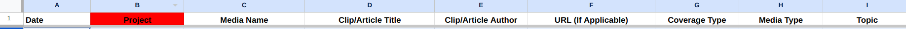
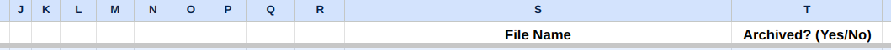

# Media Archival Tool


This is a Python script that will (mostly) automate archiving of Internet webpages. Specifically, it automates the following process:

- Open a Google Sheets spreadsheet (which must be formatted in a specific way, [see below](#how-to-setup-google-drive)) containing links to desired webpages, one per row
- Open a webpage in Chrome
- Save the page as PNG, PDF, and MHTML (same filename but different extension)
- Upload the result to a Google Drive in an appropriate folder organized by year and month (YYYY/MM/)
- Update the spreadsheet to indicate successful archival
- Repeat for each page

# How to setup Google Drive

Create a folder in your Google Drive and a new spreadsheet. The script expects the first row of your spreadsheet to be formatted like this.




You can format it different but you'll need to edit the script. Open `mat.py` and inside the `uploader`, `validator`, and `repairer` functions, you'll need to find and change the following lines.

```
entryURL = currentRow[5]
entryMediaType = currentRow[7]
entryTopic = currentRow[8]
entryFilename = currentRow[18]
...
entryArchived = getItem(currentRow, 19)
```

The numbers `5`, `7`, `8`, `18`, and `19` are for the page URL, media type, topic, filename, and whether it is archived.

Note that media type and topic are only used to print debugging messages and to skip certain rows, so you could delete all references to them from the code without affecting anything substantial.

The categories that are important are date, URL, filename (used to name the uploaded Drive files), and archived (yes/no). The filename should also use the following formula, which assumes a date in the first column. (The formula is for the second row, use auto-fill to complete other rows.)

```
=LET(
  dateTopicPrefix, CONCATENATE(TEXT(A2, "yyyy-mm-dd"), " - ", I2),
  baseName, CONCATENATE(dateTopicPrefix, " - ", C2),
  baseNameCount, COUNTIFS($S$1:S1, CONCATENATE(dateTopicPrefix,"*"),
                          $C$1:C1, C2), 
  IF(GT(baseNameCount,0), CONCATENATE(baseName, " ", baseNameCount+1), baseName)
)
```

# How to use the tool

1. Install Python 3 and download this repository.

2. Follow [these steps](https://developers.google.com/drive/api/quickstart/python) to set up up the Google Drive and Sheets APIs. (The steps are the same for both so you only need to do it once.) You can stop once you've obtained the `credentials.json` file, which is all you really need. Store the file in the project directory.

3. Create and activate a Python virtual environment for the project as follows.

```
cd <project-directory>
python -m venv <environment-name>
source <environment-name>/bin/activate
````

(You can deactivate the virtual environment using the `deactivate` command.)

4. Install the required libraries.

```
pip install --upgrade google-api-python-client google-auth-httplib2 google-auth-oauthlib
pip install selenium
pip install pyautogui
pip install pyperclip
```

5. Save the [GoFullPage](https://chrome.google.com/webstore/detail/gofullpage-full-page-scre/fdpohaocaechififmbbbbbknoalclacl) and [uBlock Origin](https://chrome.google.com/webstore/detail/ublock-origin/cjpalhdlnbpafiamejdnhcphjbkeiagm) extensions as CRX files in your project directory using [this](https://standaloneinstaller.com/online-tools/crx-downloader) tool. Name the files `GoFullPage.crx` and `UblockOrigin.crx` respectively.

Note: GoFullPage is needed for PNG screenshots but uBlock Origin is not really necessary. You can get rid of this by erasing the line `options.add_extension('./UblockOrigin.crx')` from the script.

6. Create a text file in the project directory named `settings.txt`. You need to add the ID of your Google Drive folder and the ID of your spreadsheet as follows. (You can find IDs in URLs when you open Google Drive files and folders in your browser.)

```
spreadsheetId = <ID>
driveId = <ID>
```

7. Run the script once using `python mat.py`. You should be taken to a Google authentication screen in your default browser. Complete the authentication process.

8. You can now run the script. Use `python mat.py --help` to see options.
